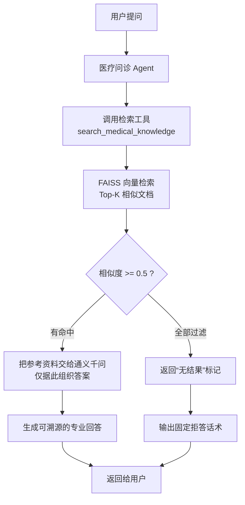
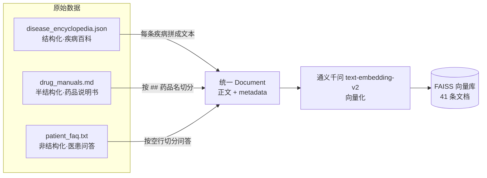
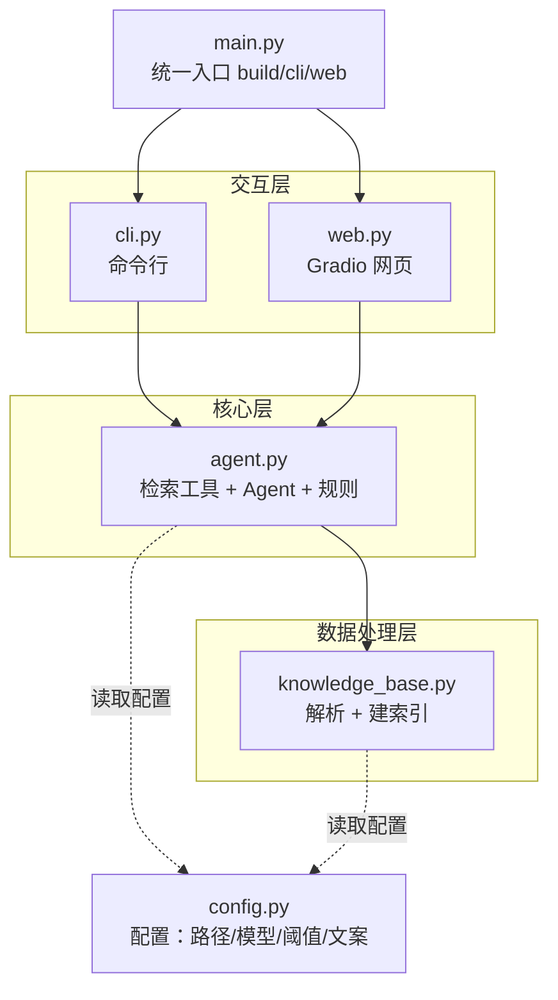
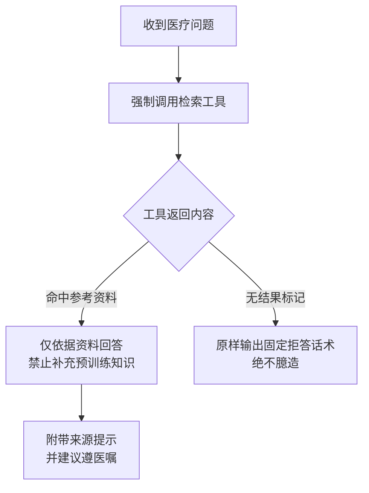

# 医疗问诊 AI Agent — 架构图（可贴入 PPT）

> 下面是 4 张 Mermaid 图，用途分别对应 PPT 的不同页面。
> **如何变成图片**：
> - 方法一：打开 https://mermaid.live ，粘贴代码块里的内容，右上角导出 PNG/SVG，贴进 PPT。
> - 方法二：PyCharm / VS Code 装 Mermaid 预览插件直接看。
> - 方法三：若用 Typora、语雀、飞书文档，粘贴即可自动渲染。

---

## 图 1 · 总体 RAG 流程（对应 Slide 5 技术架构）

---

## 图 2 · 三类异构数据处理（对应 Slide 7 难点一）

---

## 图 3 · 项目模块分层（对应 Slide 6 模块设计）

---

## 图 4 · Agent 决策逻辑（对应 Slide 9 规则固化）

---

> 建议：Slide 5 用图 1，Slide 6 用图 3，Slide 7 用图 2，Slide 9 用图 4，视觉统一、逻辑清晰。
